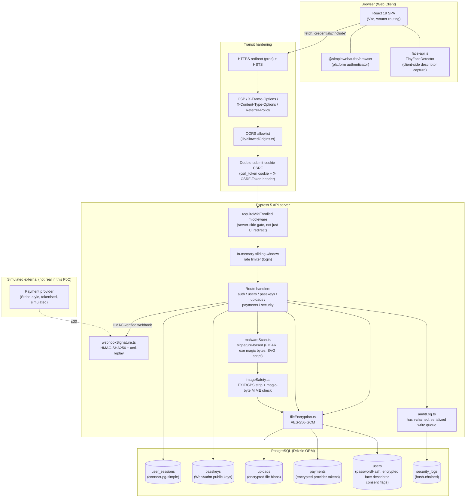

# Security Architecture — SecureAI

Team 1: Technical Security. This diagram covers the CORE + IMPORTANT controls actually built in this
proof-of-concept (see `replit.md` for the full narrative of each decision).

## Component diagram

## Why these boundaries

- **Every protected route sits behind `requireMfaEnrolled`, not just the frontend router.** The React route
  guard is UX only — a direct API call with a valid session cookie but incomplete MFA is still rejected
  server-side. This is the single most important boundary in the diagram: it's what makes "mandatory MFA"
  actually mandatory rather than a suggestion the client could skip.
- **CSRF sits in front of the MFA gate, not behind it.** A forged cross-site request can't even reach a
  route handler without a matching `X-CSRF-Token`, regardless of MFA state.
- **Encryption and audit logging are library calls used *by* route handlers, not a separate service.**
  There's no key-management service or external HSM in this PoC — `FILE_ENCRYPTION_KEY` is a single
  symmetric key from environment config. That's an accepted limitation of a demo, documented as such
  (see `04_Threat_Model_Risk_Assessment.md`, R-DP-3).
- **The payment provider is simulated.** No real Stripe (or equivalent) integration exists; the webhook
  signature verification path is real and independently testable (`lib/webhookSignature.ts`), but nothing
  in this PoC actually calls out to a payment network.

## Mapping to the brief's CORE areas

| Brief CORE area | Where it lives in this diagram |
 ---|---|
| Authentication + MFA | `requireMfaEnrolled`, `auth`/`passkeys` routes, `users` table consent+descriptor columns |
| Data protection | `fileEncryption.ts`, `imageSafety.ts`, `malwareScan.ts` |
| Access control | Route-level ownership checks inside each handler (not shown as a separate box — enforced per-route) |
| Secure communication | Edge subgraph (HTTPS/HSTS, headers, CORS, CSRF) |
| Logging | `auditLog.ts` → `security_logs` |
| Risk assessment | See `04_Threat_Model_Risk_Assessment.md` |
