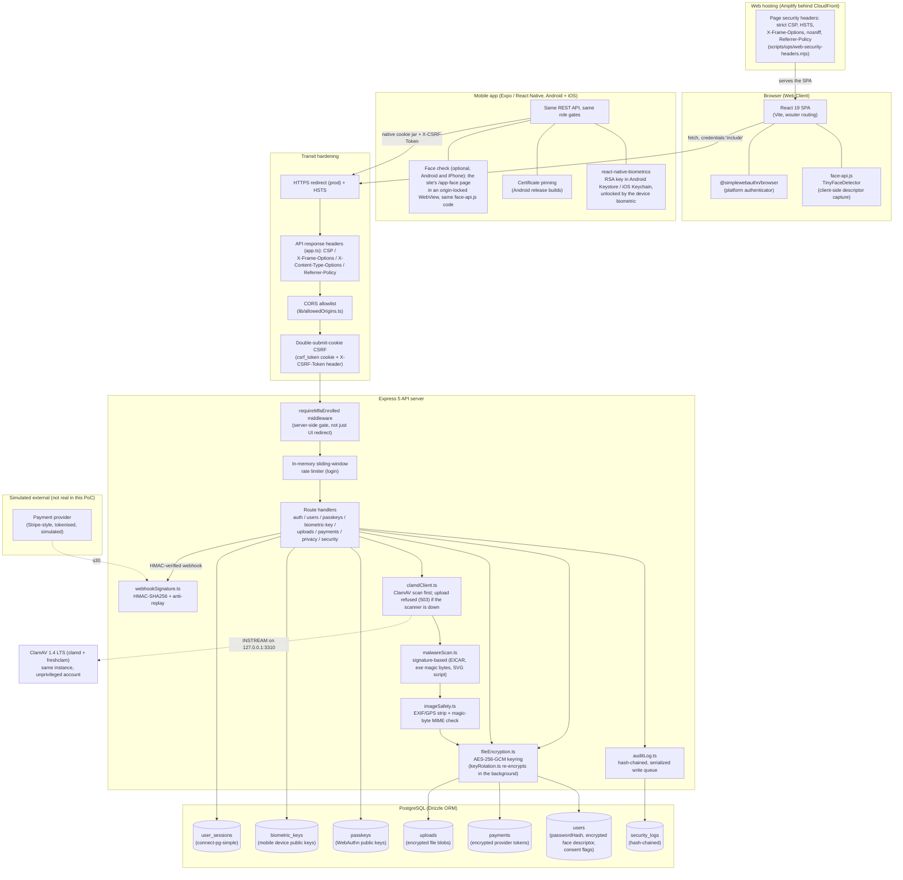

# Security Architecture — SecureAI

Team 1: Technical Security. This diagram covers the CORE + IMPORTANT controls actually built in this
proof-of-concept.

## Component diagram

```mermaid
flowchart TB
    subgraph Client["Browser (Web Client)"]
        UI["React 19 SPA<br/>(Vite, wouter routing)"]
        FaceLib["face-api.js<br/>TinyFaceDetector<br/>(client-side descriptor capture)"]
        WebAuthnClient["@simplewebauthn/browser<br/>(platform authenticator)"]
        UI --- FaceLib
        UI --- WebAuthnClient
    end

    subgraph Mobile["Mobile app (Expo / React Native, Android + iOS)"]
        MobileUI["Same REST API, same role gates"]
        DeviceKey["react-native-biometrics<br/>RSA key in Android Keystore / iOS Keychain,<br/>unlocked by the device biometric"]
        Pinning["Certificate pinning<br/>(Android release builds)"]
        FaceCheck["Face check (optional, Android and iPhone): the site's /app-face page<br/>in an origin-locked WebView, same face-api.js code"]
        MobileUI --- DeviceKey
        MobileUI --- Pinning
        MobileUI --- FaceCheck
    end

    subgraph WebHost["Web hosting (Amplify behind CloudFront)"]
        PageHeaders["Page security headers: strict CSP, HSTS,<br/>X-Frame-Options, nosniff, Referrer-Policy<br/>(scripts/ops/web-security-headers.mjs)"]
    end

    subgraph Edge["Transit hardening"]
        HTTPS["HTTPS redirect (prod) + HSTS"]
        Headers["API response headers (app.ts): CSP /<br/>X-Frame-Options / X-Content-Type-Options / Referrer-Policy"]
        CORS["CORS allowlist<br/>(lib/allowedOrigins.ts)"]
        CSRF["Double-submit-cookie CSRF<br/>(csrf_token cookie + X-CSRF-Token header)"]
    end

    subgraph API["Express 5 API server"]
        MW["requireMfaEnrolled middleware<br/>(server-side gate, not just UI redirect)"]
        RateLimit["In-memory sliding-window<br/>rate limiter (login)"]
        Routes["Route handlers<br/>auth / users / passkeys / biometric-key /<br/>uploads / payments / privacy / security"]
        AuditLib["auditLog.ts<br/>hash-chained, serialized write queue"]
        Encrypt["fileEncryption.ts<br/>AES-256-GCM keyring<br/>(keyRotation.ts re-encrypts in the background)"]
        Clamd["clamdClient.ts<br/>ClamAV scan first; upload refused (503) if the scanner is down"]
        Scan["malwareScan.ts<br/>signature-based (EICAR, exe magic bytes, SVG script)"]
        ImgSafety["imageSafety.ts<br/>EXIF/GPS strip + magic-byte MIME check"]
        WebhookSig["webhookSignature.ts<br/>HMAC-SHA256 + anti-replay"]
    end

    subgraph DB["PostgreSQL (Drizzle ORM)"]
        Users[("users<br/>(passwordHash, encrypted face descriptor,<br/>consent flags)")]
        Passkeys[("passkeys<br/>(WebAuthn public keys)")]
        BioKeys[("biometric_keys<br/>(mobile device public keys)")]
        Uploads[("uploads<br/>(encrypted file blobs)")]
        Payments[("payments<br/>(encrypted provider tokens)")]
        Logs[("security_logs<br/>(hash-chained)")]
        Sessions[("user_sessions<br/>(connect-pg-simple)")]
    end

    subgraph ExternalSim["Simulated external (not real in this PoC)"]
        Provider["Payment provider<br/>(Stripe-style, tokenised, simulated)"]
    end

    PageHeaders -->|serves the SPA| UI
    UI -->|fetch, credentials:'include'| HTTPS --> Headers --> CORS --> CSRF --> MW
    MobileUI -->|"native cookie jar + X-CSRF-Token"| HTTPS
    MW --> RateLimit --> Routes
    Routes --> AuditLib --> Logs
    Routes --> Encrypt --> Users
    Routes --> Encrypt --> Payments
    Routes --> Clamd --> Scan --> ImgSafety --> Encrypt --> Uploads
    Clamd -.->|"INSTREAM on 127.0.0.1:3310"| ClamAV["ClamAV 1.4 LTS (clamd + freshclam)<br/>same instance, unprivileged account"]
    Routes --> Passkeys
    Routes --> BioKeys
    Routes --> Sessions
    Routes -->|HMAC-verified webhook| WebhookSig
    Provider -. s30 .-> WebhookSig
```

## Why these boundaries

- Every protected route sits behind `requireMfaEnrolled`, not just the frontend router: the React route
  guard is UX only — a direct API call with a valid session cookie but incomplete MFA is still rejected
  server-side. This is the single most important boundary in the diagram: it's what makes "mandatory MFA"
  actually mandatory rather than a suggestion the client could skip.
- CSRF sits in front of the MFA gate, not behind it: a forged cross-site request can't even reach a
  route handler without a matching `X-CSRF-Token`, regardless of MFA state.
- Encryption and audit logging are library calls used _by_ route handlers, not a separate service —
  there's no key-management service or external HSM in this PoC. Data at rest is encrypted under a keyring
  (`lib/fileEncryption.ts`): each stored value records which key encrypted it, so the key can be replaced
  and older values re-encrypted in the background (`lib/keyRotation.ts`). The keys are environment
  config, not a KMS or HSM (see `04_Threat_Model_Risk_Assessment.md`, R-DP-3).
- The payment provider is simulated: no real Stripe (or equivalent) integration exists; the webhook
  signature verification path is real and independently testable (`lib/webhookSignature.ts`), but nothing
  in this PoC actually calls out to a payment network.

## Where it runs (live site, as of 2026-09-30)

All in AWS `us-east-1` (N. Virginia), one CloudFront domain: <https://d2zb1uxt99m5ks.cloudfront.net>.

- **Web app:** Amplify hosting behind CloudFront. The page security headers (strict CSP with no inline
  scripts or styles, HSTS, `X-Frame-Options: DENY`, `nosniff`, `Referrer-Policy: no-referrer`) are
  defined once in `scripts/ops/web-security-headers.mjs` and applied by `scripts/ops/deploy-web.mjs`,
  which also refuses a build that loads fonts from elsewhere and checks the live headers after deploying
  (R-SC-4). Fonts are self-hosted.
- **API:** Elastic Beanstalk (`secureai-api-env2`, Node.js 24 on Amazon Linux 2023, API v21), reached
  through the same CloudFront domain, so the session and CSRF cookies are same-site (`SameSite=Lax`,
  R-SC-5). The API believes a forwarded client IP only from CloudFront's published ranges
  (`lib/cloudfrontRanges.ts`). ClamAV runs on the same instance (R-DP-2).
- **Database:** RDS PostgreSQL (`secureai2`). The API connects as the restricted `secureai_app` role over
  TLS, checking the server certificate against Amazon's bundle (R-AC-2);
  `scripts/ops/check-production-db.mjs` re-checks both read-only. The disk is not encrypted and automated
  backups are off (R-DP-5, open).
- **Mobile:** built locally (Android APK; iOS needs a Mac), pointed at the live API at build time with
  `EXPO_PUBLIC_API_BASE_URL`. Android release builds pin the CloudFront domain's key; iOS does not yet
  (R-MOBILE-4).

## Mapping to the brief's CORE areas

| Brief CORE area      | Where it lives in this diagram                                                                      |
| -------------------- | --------------------------------------------------------------------------------------------------- |
| Authentication + MFA | `requireMfaEnrolled`, `auth`/`passkeys`/`biometricKey` routes, `users` consent+descriptor columns   |
| Data protection      | `fileEncryption.ts`, `imageSafety.ts`, `clamdClient.ts` (ClamAV), `malwareScan.ts`                  |
| Access control       | Route-level ownership checks inside each handler (not shown as a separate box — enforced per-route) |
| Secure communication | Edge subgraph (HTTPS/HSTS, headers, CORS, CSRF), web hosting headers, mobile certificate pinning    |
| Logging              | `auditLog.ts` → `security_logs`                                                                     |
| Risk assessment      | See `04_Threat_Model_Risk_Assessment.md`                                                            |
