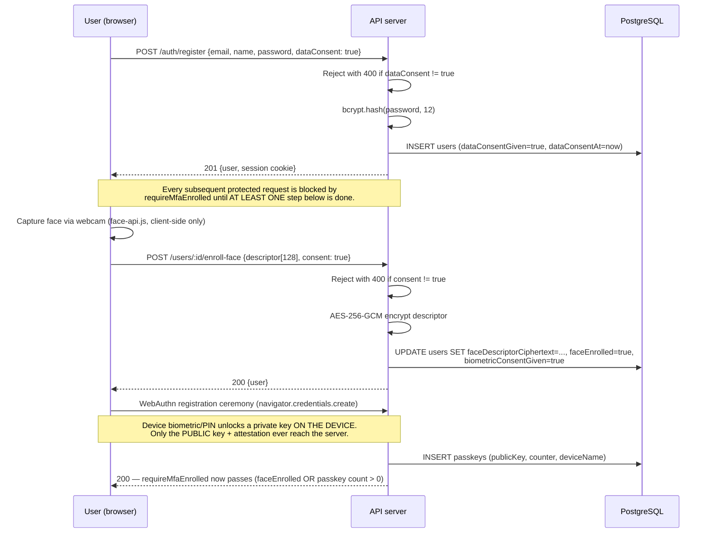

# Authentication Flow (with Biometric MFA) — SecureAI

Addresses the brief's explicit warning: *"never trust a 'biometric OK' message coming from the app —
the biometric should unlock a secret key on the device that signs a challenge from your server."*

## Registration + enrollment



## Login (two-step, MFA-enforced)

```mermaid
sequenceDiagram
    participant U as User (browser)
    participant A as API server
    participant DB as PostgreSQL

    U->>A: POST /auth/login {email, password}
    A->>A: checkAndRecordRequest() — atomic reservation against<br/>per-account (5/15min) and per-IP (20/15min) limits, BEFORE any DB/bcrypt work
    alt over the limit
        A-->>U: 429 Too many attempts
    else account not found
        A->>A: bcrypt.compare(password, DUMMY_PASSWORD_HASH)<br/>(burns identical time — no user-enumeration via timing)
        A-->>U: 401 "Invalid email or password"
    else account found
        A->>DB: SELECT user; bcrypt.compare(password, user.passwordHash)
        alt wrong password
            A-->>U: 401 "Invalid email or password" (attempt stays counted)
        else correct password
            A->>A: Create pendingUserId + tempToken in session<br/>(short-lived — NOT a full session yet)
            A-->>U: 200 {requiresFaceVerification: true, faceAvailable, passkeyAvailable, tempToken}
        end
    end

    Note over U,A: Step 2 — the actual second factor. Password alone never<br/>grants a full session.

    alt User completes with passkey (preferred)
        U->>A: GET /passkeys/login-options (challenge issued, tied to tempToken)
        A-->>U: WebAuthn challenge
        U->>U: navigator.credentials.get() — device biometric/PIN unlocks<br/>the on-device private key, which SIGNS the challenge
        U->>A: POST /passkeys/login-verify {signed assertion}
        A->>A: Verify signature against stored PUBLIC key<br/>(this signature IS the second factor — not a boolean)
        A->>A: Upgrade session: req.session.userId = user.id; clear pending state
        A-->>U: 200 {user} — full session established
    else User completes with face scan (fallback)
        U->>U: Blink-based liveness check (client-side EAR tracking over<br/>live frames) must confirm before capture proceeds
        U->>U: Capture live descriptor via webcam
        U->>A: POST /auth/face-verify {tempToken, descriptor[128]}
        A->>DB: SELECT + decrypt stored descriptor
        A->>A: Euclidean distance(stored, live) < 0.6 ?
        alt match
            A->>A: Upgrade session, clear pending state
            A-->>U: 200 {user} — full session established
        else no match / MFA_MAX_ATTEMPTS(3) exceeded / TTL(2min) expired
            A-->>U: 401 — pending session destroyed, must restart from step 1
        end
    end
```

## Why the passkey path is the "real" second factor

The face-descriptor path is a legitimate control (a live camera capture matched against an encrypted,
server-stored template), but by itself it is exactly the pattern the brief warns against: a comparison
result that a compromised or spoofed client could claim to have passed. WebAuthn closes that gap —
the server never sees the private key or the raw biometric, only a cryptographic signature over a
server-issued, single-use challenge. That signature cannot be produced without the device-held key,
regardless of what the client claims. This is why:

- On web, either factor satisfies MFA (`requireMfaEnrolled` accepts face OR passkey — a passkey-only mobile account has no way to enroll a face factor, so requiring both would lock it out permanently). Both can still be enrolled for extra assurance.
- Passkey is offered **first** at login/reset; face scan is an explicit, clearly-labelled fallback.
- Face scan now also requires a blink-based liveness check before a descriptor is captured or
  auto-submitted (`lib/livenessDetection.ts`) — defends against the most obvious spoof (a static photo
  held to the webcam) but is explicitly a client-side behavioral check, not a cryptographic proof, unlike
  the passkey signature. See `04_Threat_Model_Risk_Assessment.md` (R-BIO-1) for the honest boundary.
- The password-reset flow requires the *same* proof as login — a reset link alone is never sufficient,
  closing the classic "account recovery becomes the MFA bypass" failure mode.

## Session model

- `express-session`, PostgreSQL-backed (`connect-pg-simple`), `httpOnly`, `secure` in production,
  `sameSite: lax`.
- The `pendingUserId`/`tempToken` pair created after step 1 is **not** a valid session — no protected
  route accepts it. Only after step 2 succeeds is `session.userId` set.
- `MFA_CHALLENGE_TTL_MS` (2 minutes) and `MFA_MAX_ATTEMPTS` (3) bound how long/how many times a pending
  challenge can be attempted before the pending session is destroyed outright.
- **Revocation ("logout everywhere")**: `POST /auth/logout-all` deletes every persisted row in the
  `session` table belonging to the account (matched via the session's stored `userId`), not just the
  session making the request. Mitigates the brief's "device theft while unlocked" scenario (§8) — a lost
  or stolen device with a live session can be locked out from any other device, without needing the
  stolen device itself or a password change. Reactive, not preventive.
- **Idle timeout + absolute cap** (`lib/sessionPolicy.ts`): the cookie is a 30-minute rolling idle
  timeout (`rolling: true`), so an abandoned session expires on its own, plus an independent 12-hour
  absolute cap checked on every request, so a session an attacker keeps "warm" with their own traffic
  still expires. Together with logout-all this covers both the "owner notices" and "nobody notices"
  cases (see `04_Threat_Model_Risk_Assessment.md`, R-AUTH-5).
- **Step-up re-authentication**: self-account deletion requires the current password re-entered and
  verified server-side immediately before the delete — an unlocked session alone isn't enough for the one
  irreversible action (R-AC-3).
