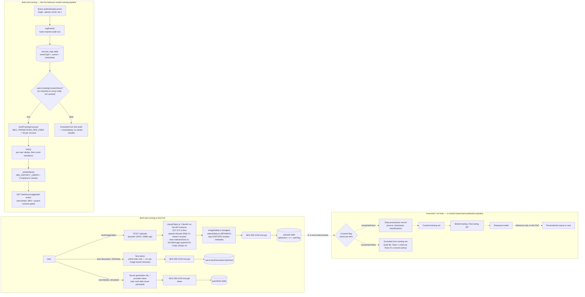

# Data Flow Diagram (incl. Training Pipeline) — SecureAI

The brief's hypothetical parent app "learns from a mix of public data and user uploads... to create
personalised experiences" and requires a data flow diagram that includes the training pipeline.
face-api.js itself is still a pretrained, client-side comparison library, never fine-tuned or updated
from user data — that part of the brief's framing stays hypothetical, drawn below as an explicit
assumption. But this app now also trains a second, much smaller model for real: a behavior-transition
model (`artifacts/api-server/src/lib/behaviorModel.ts`) that learns which action an account is likely to
take next from the *sequence of audit-log event types* its activity produces — never from the *content*
of anything a user uploads. That's a deliberate scope line: uploads are AES-256-GCM encrypted specifically
so nothing but the owner can read them, so a model that needed to decrypt and process upload content
would be a real regression against that guarantee. Both pipelines — the real, live one and the
still-hypothetical, content-based one — are shown below, in separate subgraphs, so it's clear which is
which.

## What actually exists in this PoC (solid) vs. assumed (dashed)

## Design decisions for the training pipeline — real (behavior model) vs. assumed (content-based)

1. Consent gates ingestion, not just storage — done for real in the live pipeline:
   `trainingConsentGiven` (`lib/db/src/schema/users.ts`) is a dedicated flag, separate from
   `dataConsentGiven`, toggleable any time via `POST /users/me/training-consent`.
   `buildTrainingCorpus()` re-checks it fresh on every single call — not a cached value from
   registration time — so it exceeds the original assumption below ("re-checking the flag at
   pipeline-run time rather than just at upload time"): here, every *inference* is itself a fresh
   pipeline run, so withdrawn consent takes effect on the very next request, with no separate retrain
   step needed. Verified live: a seeded test account with `trainingConsentGiven=false` producing the
   exact same activity pattern as the consented majority was confirmed absent from the built corpus.
   For a hypothetical content-based pipeline (see "Assumed" below), the same principle would apply at
   the `TrainSet` ingestion step.
2. Provenance / poisoning defense — implemented in the live pipeline, and now actually proven:
   `buildTrainingCorpus()` caps each consented user at `MAX_TRANSITIONS_PER_USER = 50` transitions per
   corpus build, so no single account can dominate the training data — the direct analog of the
   standalone PoC's `MAX_DOCS_PER_USER` (which stays unproven: its synthetic data never exceeds 2
   records/user). The live app's cap was pushed past its limit for real: a seeded test account with 60
   raw audit-log events was confirmed to enter the corpus truncated at exactly 50, not 60, verified
   against a real Postgres-backed run of `buildTrainingCorpus()`.

   Brief §6's *source*-provenance concept still doesn't apply to the **behavior** model — it trains on
   the app's own audit-log event types, which have no external "source" to validate. It very much does
   apply to the **content-personalization** model (§5c of `05_Consent_and_Deletion_Design.md`), which
   reads upload content, and as of 2026-09-18 it is enforced there. See §2b below.

### 2b. Source provenance — Team 2's matrix, enforced (added 2026-09-18)

Brief §6 splits this row: *Team 2 decides which sources are allowed; Team 1 records origin and validates
inputs.* Team 2 delivered their half on 2026-09-09 (`09_Team2_Data_Source_Acceptability_Matrix.md`).
Until now Team 1 had not built its half, so the matrix was a reference document that no code read —
precisely the gap `08_Requests_to_Team2.md` §3 had named, where the consent gate "tags every record with
a source/consent identifier but has no allowed-sources list to check it against."

What exists now:

- **Origin is recorded.** `uploads.content_source` (see `lib/db/src/schema/uploads.ts`) stores a declared
  origin per file, one value per relevant matrix row: `own_work`, `third_party_individual`,
  `published_work`, `social_media`, `incidental_third_party_ip`, plus `unspecified`.
- **Inputs are validated.** `artifacts/api-server/src/lib/dataProvenance.ts` encodes the matrix as rules,
  each carrying the matrix row it was read from so any decision is traceable to Team 2's document rather
  than taken on trust. `assessTrainingEligibility(source, fileType)` is the single decision point.
- **It is a two-axis check, because the matrix is a two-dimensional table.** A one-dimensional test
  cannot express it: a diary is trainable, a photograph by the same author is not (no bystander-consent
  workflow exists), and text is trainable only when the uploader wrote it. Both axes must agree.

The honest framing of what changed: the content model's previous `fileType = "text"` filter was already
the right answer on the *file-type* axis, but it was a hardcoded constant with its reasoning in a
comment. The *source* axis was absent entirely — an uploaded copy of a published book was
indistinguishable from the uploader's own diary. That was the live exposure, and it is the half this
closes. The permitted set is unchanged in size (`own_work` + `text` only, 1 of 24 possible pairs), but it
is now enforced on both axes and derived from the matrix rather than asserted.

`unspecified` is the fail-closed default, including for every row that predates the column. Defaulting to
`own_work` would have silently enrolled the existing corpus into training on an assumption nobody made,
against the brief's own "treat every input as hostile" ground rule. An undeclared upload stays fully
usable by its owner; only training is withheld.

A rejected source writes its own `TRAINING_SOURCE_REJECTED` audit event, separate from `UPLOAD_CREATED`,
recording which axis refused. That distinction is the useful part for a reviewer: blocked-by-source is a
rights question, blocked-by-file-type is a governance workflow this app has not built, and only the second
is a roadmap item.

Verified by `pnpm --filter @workspace/api-server run verify:provenance` (`dataProvenance.verify.ts`,
8/8 passing, no server or database needed). The test that matters is the pinned training surface: the
admitted set is written out longhand rather than computed, so any widening fails the check and has to be
a deliberate, reviewed change. It also asserts that high-copyright sources are refused *on the source
axis* rather than incidentally — otherwise a published book excluded only for being the wrong file type
would sail through the moment someone pasted it as plain text.
3. Memorisation/leakage — a real concern with a real, verified fix in the live pipeline:
   `MIN_DISTINCT_USERS = 3` in `behaviorModel.ts` refuses to surface any prediction not independently
   observed from 3+ distinct consented accounts. Verified live end-to-end against the running `GET
   /behavior/suggested-action` endpoint: a canary transition seeded from exactly 1 test account was
   refused (`predictNext` returned `null`), while a transition shared by 4 test accounts was correctly
   surfaced. For the still-hypothetical content-based pipeline, standard mitigations (differential
   privacy during training, output filtering at inference, membership-inference testing before
   release) remain unimplemented and unsimulated — a materially harder problem than the closed-set,
   discrete-event prediction the live behavior model does.
4. Deletion — the live pipeline's compute-on-read architecture is a genuine structural win here,
   not a claim of solving unlearning in general: for the data this app stores directly (uploads,
   face descriptors, payment tokens), deletion is a real, working database operation (see
   `05_Consent_and_Deletion_Design.md`). For the behavior model specifically, nothing is ever
   persisted between requests: `buildTrainingCorpus()` + `train()` re-run from the current
   `security_logs` table on every `GET /behavior/suggested-action` call, so a deleted account (or one
   that withdrew `trainingConsentGiven`) is completely absent from the very next prediction, with no
   stale trained artifact anywhere to retract. That property holds *because* this model is cheap
   enough to rebuild per request — it isn't a general answer to the "unlearning" problem the brief
   flags, which stays genuinely hard for any model expensive enough to need persistent, long-lived
   training.
5. Model API protection — two distinct controls, both built and verified: the brief names "rate
   limiting" and "query monitoring" separately, so both exist independently for `GET
   /behavior/suggested-action`, which also sits behind `requireParentConsent` and `requireMfaEnrolled`.
   Rate limiting: `requestRateLimit("behavior-suggested-action", 30, 5 * 60 * 1000)` — the same reusable
   pattern already covering login, uploads, payments, and passkey registration. Verified live: the 31st
   request from one session inside the 5-minute window received `429`. Query monitoring: every
   successful call — not only ones that trip the rate limit — writes its own `BEHAVIOR_MODEL_QUERIED`
   audit event, deliberately excluded from the training corpus itself (see `behaviorModel.ts`'s
   `META_EVENT_TYPES` — without that exclusion, querying the model would itself become a "next action"
   the model starts predicting, and would blank out a user's own next suggestion by becoming their
   own most recent event). Verified live: a real HTTP call to the endpoint was confirmed to add exactly
   one such row for that account. Output filtering doesn't apply here in the generative sense — the
   endpoint's whole output space is one of a fixed, closed set of audit-log event type strings, not
   free text.
6. Prompt-injection & unsafe output (STRETCH) — not applicable to either pipeline: the live
   behavior model predicts one of a fixed, closed set of event-type strings; it has no
   instruction-following behavior, free-text output, or tool access to inject against. Verified by
   searching the codebase (`openai`, `anthropic`, `completion`, `generat*`, etc. — no matches beyond
   incidental words like "generated"). No generative model, LLM call, or chat interface exists
   anywhere in this app. If the hypothetical content-based pipeline's model turned out to be
   generative, the equivalent controls (input sanitization before any model-facing prompt, output
   filtering before rendering model output back to a user) would sit at the same layer as
   `lib/malwareScan.ts` does for uploads today.
7. Adversarial inputs (STRETCH) — the one real gap here, different from the others: unlike
   everything else above, face-api.js is a real model performing real inference in this PoC (face
   detection + descriptor extraction, client-side) — not hypothetical. Adversarial examples are a
   genuine, open question: could a specifically crafted image (imperceptible pixel perturbations, an
   adversarial patch, or a real-time pattern shown to the webcam) cause face-api.js to extract a
   descriptor that falsely matches a different enrolled user, or evade detection? This PoC has no
   defense against that class of attack and doesn't claim one — a different threat model from the
   presentation attacks (photos, tilted photos, still-photo noise) liveness detection defends against.
   Defeating genuine adversarial perturbations is an open research problem even for production biometric
   systems with dedicated anti-spoofing hardware. Documented as an accepted STRETCH-tier gap (see
   `04_Threat_Model_Risk_Assessment.md`, R-ADV-1) rather than folded into R-BIO-1's presentation-attack
   framing, since they're genuinely different attack classes.

## What this app's real data flow demonstrates instead

Every arrow in the two "Built and running" subgraphs above is a genuine, testable control: uploads are
scanned and stripped before encryption, biometric data never leaves the browser as a raw image, payment
data is tokenised before it's ever written to disk, and the behavior model's own consent gate,
per-user poisoning cap, and memorisation threshold are all live and independently verified end-to-end
against the running server. That's the CORE "data protection" + "handle uploads safely" brief
requirement, plus a real (if deliberately narrow-scoped) answer to "AI/ML Model & Pipeline Security" —
separate from, and not blocked by, the content-based personalisation gap above, which remains an
honestly-scoped assumption rather than something this app claims to have built.
